# WorkGo – Business & System Flows
## Tổng hợp luồng nghiệp vụ và luồng hệ thống từ `WorkGoArchitecture_ver2.md`

> **Nguồn duy nhất:** `WorkGoArchitecture_ver2.md` – WorkGo Architecture, Version 2.0 – Final Design (Ver 2).  
> **Mục đích:** Tổng hợp lại các luồng nghiệp vụ và luồng hệ thống đã được mô tả trong kiến trúc, theo dạng sequence diagram + step-by-step + business rules.  
> **Nguyên tắc:** Không bổ sung business flow ngoài tài liệu nguồn. Các thuật ngữ như `execution_type`, `LOGISTICS_DELIVERY`, `ESCROW_ACCOUNT`, `SAGA_INSTANCE`, `ORDER_SNAPSHOT`, `DELIVERY_PACKAGE` được giữ nguyên.

---

# Phần 1. Nhóm luồng nghiệp vụ cốt lõi (Core Business Flows)

## Flow A – Flow mua dịch vụ (Service Listing)

### Tên luồng
**Luồng mua dịch vụ trực tiếp từ Service Listing**

### Các tác nhân tham gia

- **Provider** – tạo và bán `SERVICE`.
- **Client** – tìm kiếm, xem, liên hệ/mua dịch vụ.
- **Catalog Service** – sở hữu `SERVICE`, `SERVICE_PACKAGE`, `SERVICE_ADDON`.
- **Communication Service** – phục vụ `MESSAGE`/`CONVERSATION` theo context `SERVICE`.
- **Order Service** – tạo và quản lý `ORDER`, `ORDER_SNAPSHOT`, `EXECUTION`.
- **Payment Service** – xử lý `PAYMENT`, `ESCROW_ACCOUNT`, holding/release.
- **Trust Service** – xử lý Review sau khi Order hoàn thành.

### Diagram – Sequence

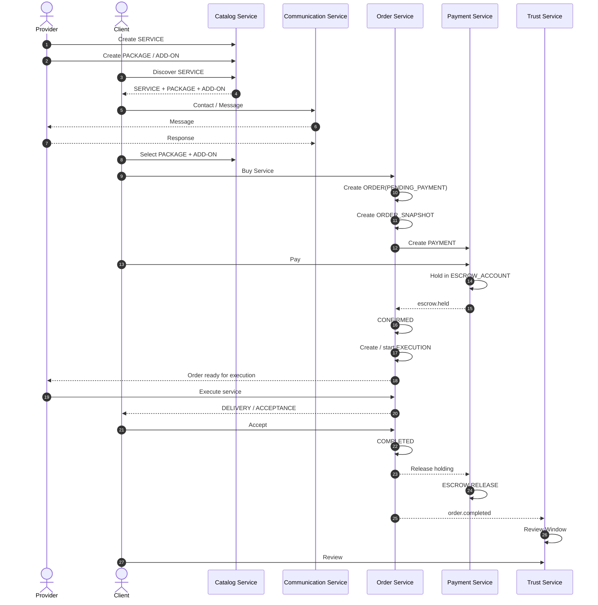

### Diễn giải chi tiết

1. **Provider tạo `SERVICE`.**  
   Provider chủ động đăng dịch vụ trên Catalog.

2. **Provider tạo Package và Add-on.**  
   Một Service có thể có nhiều `SERVICE_PACKAGE` như Basic / Standard / Premium và các `SERVICE_ADDON`.

3. **Client khám phá Service.**  
   Client tìm kiếm và xem Service/Package.

4. **Hai bên có thể Contact / Message trước giao dịch.**  
   Communication phục vụ trao đổi theo context `SERVICE`.

5. **Client chọn Package + Add-on.**

6. **Client mua Service.**  
   Đây là điểm tạo Order của Flow A.

7. **Order Service tạo `ORDER(PENDING_PAYMENT)`.**

8. **Order Service tạo `ORDER_SNAPSHOT`.**  
   Snapshot giữ lại thông tin Service, Provider, Package, pricing và execution tại thời điểm giao dịch.

9. **Payment Service tạo/xử lý `PAYMENT`.**

10. **Client thanh toán.**

11. **Payment Service đưa tiền vào `ESCROW_ACCOUNT` ở trạng thái holding.**

12. **Khi holding thành công, event `escrow.held` được phát về Order Service.**

13. **Order chuyển sang `CONFIRMED`.**

14. **Order bắt đầu `EXECUTION` theo `execution_type`.**

15. **Provider thực hiện dịch vụ.**

16. **Provider bàn giao và Client thực hiện Acceptance theo loại execution.**

17. **Order chuyển `COMPLETED`.**

18. **Payment Service release holding khi Order hoàn thành/đủ điều kiện release.**

19. **`order.completed` kích hoạt Trust Service.**

20. **Trust mở Review Window và xử lý Review.**

### Lưu ý / Business Rules

- Flow A là một trong **hai nguồn tạo Order** của WorkGo.
- `ORDER` chỉ được tạo sau khi Client mua Service.
- `SERVICE.execution_type` được snapshot sang `ORDER.execution_type`, sau đó dùng cho `EXECUTION.execution_type`.
- Không dùng `workflow_code`.
- `ORDER_SNAPSHOT` bảo vệ lịch sử giao dịch khi Service/Provider thay đổi về sau.
- Payment là **microservice riêng**, Order không truy cập trực tiếp database Payment.
- Online payment đi theo mô hình:
  `Payment Gateway → ESCROW HOLDING → Release / Refund`.
- `Review` thuộc **Trust Service**, không thuộc Order Service.
- `Execution` là module bên trong **Order Service**, không phải Execution Service độc lập.
- WorkGo không phải Social Network; Marketplace Core không có Like / Comment / Share / Repost / public Follower/Following / public group chat.

---

## Flow B – Flow đăng nhu cầu và đấu thầu (Post Marketplace / Bidding)

### Tên luồng
**Luồng Client đăng Post và Provider ứng tuyển / gửi Proposal**

### Các tác nhân tham gia

- **Client** – tạo `POST`, xem Proposal và chấp nhận Proposal.
- **Provider** – xem Post, tạo `APPLICATION`, tham gia trao đổi và gửi `PROPOSAL`.
- **Post Service** – sở hữu `POST`, `APPLICATION`, `PROPOSAL`.
- **Communication Service** – Message theo context `POST`.
- **Notification / Communication** – thông báo Application.
- **Order Service** – tạo Order sau khi Proposal được chấp nhận.

### Diagram – Sequence

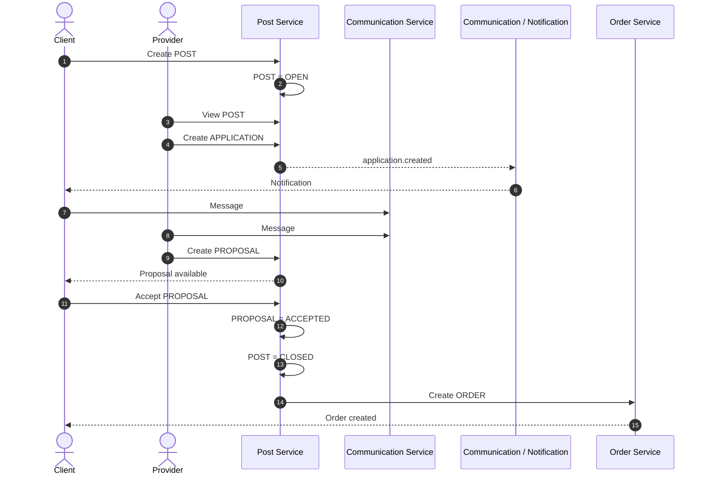

### Diễn giải chi tiết

1. **Client tạo `POST`.**
2. `POST` ở trạng thái `OPEN`.
3. **Provider xem Post.**
4. Provider gửi `APPLICATION`.
5. `application.created` có thể được Communication Service dùng để tạo Notification cho Client.
6. Hai bên trao đổi qua `MESSAGE`.
7. Provider gửi `PROPOSAL` chứa giá, thời gian dự kiến và điều kiện thực hiện.
8. Client chọn và **Accept Proposal**.
9. `PROPOSAL` chuyển `ACCEPTED`.
10. `POST` chuyển `CLOSED`.
11. Sau khi Proposal được chấp nhận và Post được đóng, **Order được tạo**.
12. Các bước Payment và Execution tiếp tục theo vòng đời Order.

### Lưu ý / Business Rules

- Quy tắc bắt buộc:
  ```text
  APPLY ≠ ORDER
  ```
- `APPLICATION` chỉ thể hiện Provider quan tâm đến Post.
- Order **không được tạo ngay khi Apply**.
- Order chỉ được tạo sau khi Client chấp nhận Proposal.
- Một Post có thể có:
  - N `APPLICATION`
  - N `PROPOSAL`
  - nhưng chỉ **một Proposal được Client chấp nhận**.
- Khi Proposal được chấp nhận phải bảo đảm:
  ```text
  PROPOSAL = ACCEPTED
  POST = CLOSED
  ```
  trong **cùng transaction của Post Service**.
- Provider chỉ được Apply khi:
  ```text
  Provider active
  AND
  Post = OPEN
  AND
  Provider != Post.client
  AND
  Provider chưa Apply Post này
  ```
- `APPLICATION` có unique:
  ```text
  (post_id, provider_id)
  ```
- `PROPOSAL.provider_id` không được lưu trực tiếp; Provider được suy ra từ `APPLICATION.provider_id`.
- Message/Notification chỉ hỗ trợ giao dịch; Communication không sở hữu business state của Post, Proposal hoặc Order.

---

# Phần 2. Nhóm luồng thực hiện đơn hàng (Execution Flows)

## Flow C – Thực hiện dịch vụ Digital (Digital Execution)

### Tên luồng
**Luồng thực hiện và bàn giao dịch vụ DIGITAL**

### Các tác nhân tham gia

- **Client**
- **Provider**
- **Order Service**
  - `ORDER`
  - `EXECUTION`
  - `DIGITAL_EXECUTION`
  - `DELIVERY_PACKAGE`
  - `DELIVERY_FILE`
  - `REVISION_REQUEST`
- **Payment Service**
  - `ESCROW_ACCOUNT`
- **Trust Service**

### Diagram – Sequence

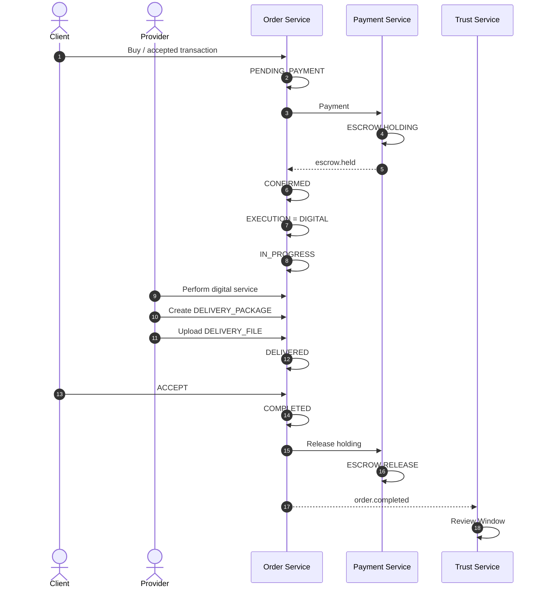

### Diễn giải chi tiết

1. Order bắt đầu từ `PENDING_PAYMENT`.
2. Payment được xử lý và tiền được giữ trong `ESCROW_ACCOUNT`.
3. Khi escrow holding thành công, Order chuyển `CONFIRMED`.
4. Execution được xác định là `DIGITAL`.
5. Order đi vào `IN_PROGRESS`.
6. Provider thực hiện công việc.
7. Provider tạo `DELIVERY_PACKAGE`.
8. Các file bàn giao được lưu trong `DELIVERY_FILE`.
9. Submission chuyển tới trạng thái `DELIVERED`.
10. Client kiểm tra và:
    - **ACCEPT** → `COMPLETED`.
    - **REVISION** → quay lại `IN_PROGRESS`.
11. `SERVICE_PACKAGE.revision_limit` là giới hạn số lần revision.
12. `REVISION_REQUEST` lưu lịch sử revision thực tế.
13. Khi Order hoàn thành, holding được release.
14. `order.completed` kích hoạt Trust Review.

### Lưu ý / Business Rules

- Digital flow cốt lõi:
  ```text
  PENDING_PAYMENT
      ↓
  CONFIRMED
      ↓
  IN_PROGRESS
      ↓
  DELIVERED
      ├── ACCEPT → COMPLETED
      └── REVISION → IN_PROGRESS
  ```
- `DELIVERY_PACKAGE` là submission của Digital Execution và được đặt tên để tránh nhầm với `SERVICE_PACKAGE`.
- `DELIVERY_FILE` lưu file thuộc một `DELIVERY_PACKAGE`.
- `SERVICE_PACKAGE.revision_limit` là giới hạn; `REVISION_REQUEST` là lịch sử thực tế.
- `WORK_EVIDENCE` không phải `DELIVERY_PROOF`.
- Auto-completion policy phải được snapshot khi Order bắt đầu; tài liệu đưa ví dụ `DIGITAL → 72h`.

---

## Flow D – Thực hiện dịch vụ On-site (Sửa chữa tận nơi, có đặt lịch)

### Tên luồng
**Luồng ONSITE – đặt lịch, giữ Booking Slot, thực hiện tại địa điểm**

### Các tác nhân tham gia

- **Client**
- **Provider**
- **Catalog Service**
  - `BOOKING_SLOT`
  - `AVAILABILITY_RULE`
- **Order Service**
  - `ORDER`
  - `ONSITE_EXECUTION`
  - `WORK_EVIDENCE`
- **Payment Service**
  - `PAYMENT`
  - `ESCROW_ACCOUNT`
- **Communication Service**
  - Notification
- **Trust Service**

### Diagram – Sequence

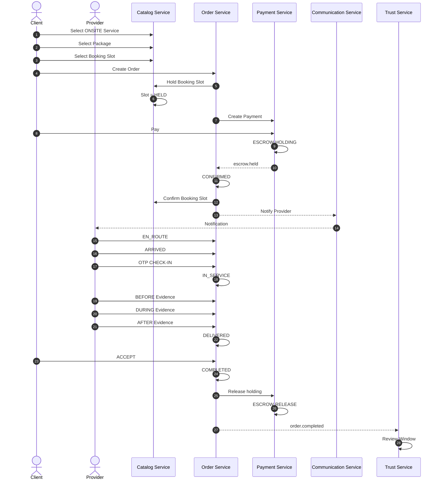

### Diễn giải chi tiết

1. Client chọn Service có `execution_type = ONSITE`.
2. Client chọn Package.
3. Client chọn `BOOKING_SLOT`.
4. Order được tạo.
5. **Booking Slot được Hold trước khi thu tiền.**
6. Slot chuyển `HELD`.
7. Payment được tạo.
8. Client thanh toán.
9. Payment chuyển tiền vào `ESCROW_ACCOUNT` ở trạng thái `HOLDING`.
10. Order chuyển `CONFIRMED`.
11. Booking Slot được confirm.
12. Provider nhận Notification.
13. Provider bắt đầu di chuyển: `EN_ROUTE`.
14. Provider tới địa điểm: `ARRIVED`.
15. Provider thực hiện `OTP CHECK-IN`.
16. Công việc chuyển vào `IN_SERVICE`.
17. Provider ghi nhận `WORK_EVIDENCE` theo các phase:
    - `BEFORE`
    - `DURING`
    - `AFTER`
18. Khi công việc bàn giao, Order chuyển `DELIVERED`.
19. Client `ACCEPT`.
20. Order chuyển `COMPLETED`.
21. Escrow được release.
22. Trust Service xử lý Review.

### Lưu ý / Business Rules

- On-site Order phải **Hold Booking Slot trước khi thu tiền** để giảm khả năng thu tiền khi slot đã bị người khác lấy.
- Khi:
  ```text
  slot.status = HELD
  ```
  bắt buộc:
  ```text
  hold_expires_at != NULL
  ```
- Worker định kỳ mỗi 1 phút tìm `HELD` slot đã hết hạn và đưa về `AVAILABLE`. Đây là safety net độc lập với RabbitMQ.
- `booking_slot_id` trong `ONSITE_EXECUTION` là logical reference tới Catalog.
- `address_snapshot` thuộc `ONSITE_EXECUTION`.
- `WORK_EVIDENCE` dùng để chứng minh quá trình thực hiện công việc.
- Tài liệu phân biệt rõ:
  ```text
  WORK_EVIDENCE
  = bằng chứng Provider đã thực hiện công việc

  DELIVERY_PROOF
  = bằng chứng hàng/tài liệu đã được giao
  ```
- Auto-completion policy phải được snapshot; tài liệu đưa ví dụ `ONSITE → 24h`.

---

## Flow E – Thực hiện dịch vụ Giao nhận vật lý (Delivery / Logistics)

### Tên luồng
**Luồng DELIVERY – Pickup → Move → Destination → Proof**

### Các tác nhân tham gia

- **Client**
- **Provider**
- **Order Service**
  - `DELIVERY_EXECUTION`
- **Payment Service**
  - `PAYMENT`
  - `ESCROW_ACCOUNT`
- **Logistic Service**
  - `LOGISTICS_DELIVERY`
  - `LOCATION_UPDATE`
  - `DELIVERY_PROOF`

### Diagram – Sequence

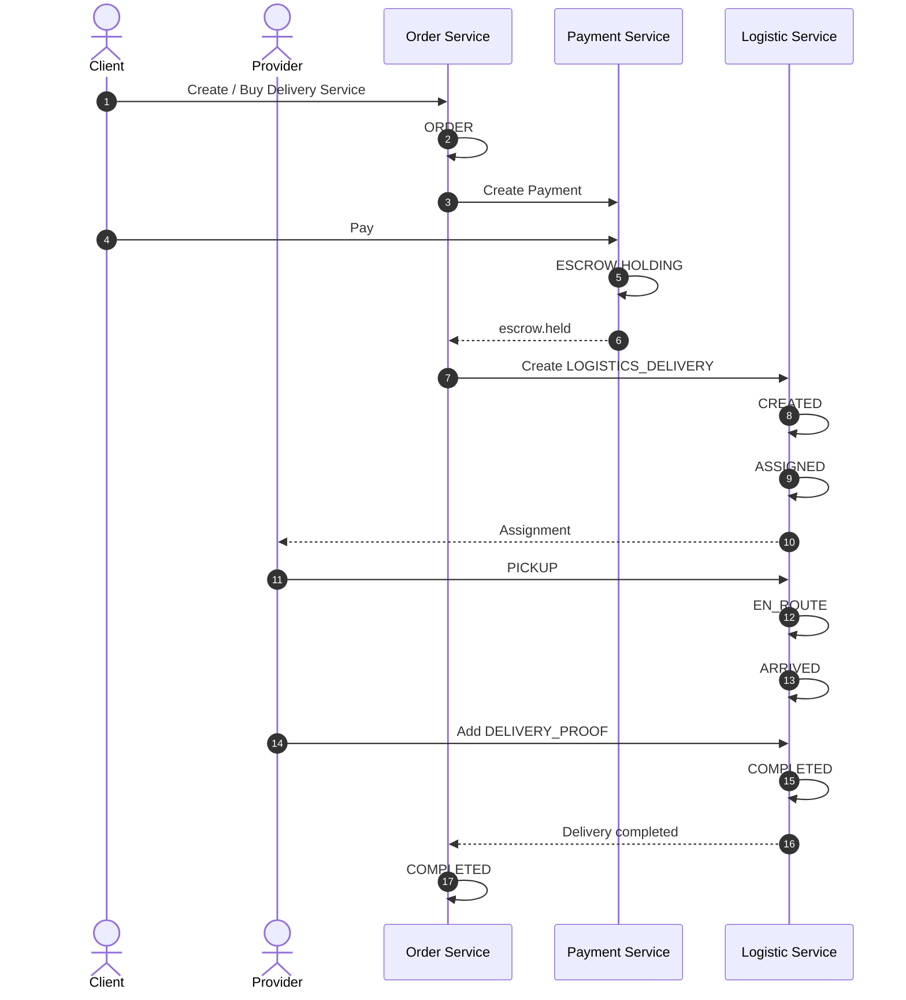

### Diễn giải chi tiết

1. Client tạo hoặc mua Delivery Service.
2. Order được tạo.
3. Payment được xử lý.
4. Tiền được giữ trong `ESCROW_ACCOUNT`.
5. Logistic Service tạo `LOGISTICS_DELIVERY`.
6. Delivery được `ASSIGNED` cho Provider.
7. Provider thực hiện Pickup.
8. Delivery đi vào `EN_ROUTE`.
9. Delivery tới nơi (`ARRIVED`).
10. Hệ thống lưu `DELIVERY_PROOF`.
11. Delivery chuyển `COMPLETED`.
12. Order chuyển `COMPLETED`.

### Lưu ý / Business Rules

- Delivery/Logistics là **microservice riêng**, không phải module con của Order.
- Order chỉ giữ logical reference tới `LOGISTICS_DELIVERY`.
- Tên `LOGISTICS_DELIVERY` được dùng để tránh nhầm với Delivery Submission trong Order.
- Luồng logistics tối giản:
  ```text
  Pickup
  → Move
  → Destination
  → Proof
  ```
- WorkGo **không xây Grab đầy đủ**.
- Không yêu cầu:
  - Advanced route optimization
  - Driver marketplace phức tạp
  - Dynamic dispatching
  - Traffic prediction
  - Full navigation
- `LOCATION_UPDATE` chỉ lưu location khi cần.
- GPS realtime **không bắt buộc ở phiên bản đầu**.
- `DELIVERY_PROOF` là bằng chứng hàng/tài liệu đã được giao, không phải `WORK_EVIDENCE`.

---

# Phần 3. Nhóm luồng Thanh toán & Xử lý phân tán (Payment & Saga Flows)

## Flow F – Thanh toán Online và giữ tiền Escrow

### Tên luồng
**Luồng Online Payment → ESCROW HOLDING → Release / Refund → Payout**

### Các tác nhân tham gia

- **Client**
- **Order Service**
- **Payment Service**
- **Payment Gateway**
- **ESCROW_ACCOUNT**
- **PROVIDER_PAYOUT_ACCOUNT**
- **PAYOUT**
- **Bank / Wallet**

### Diagram – Sequence

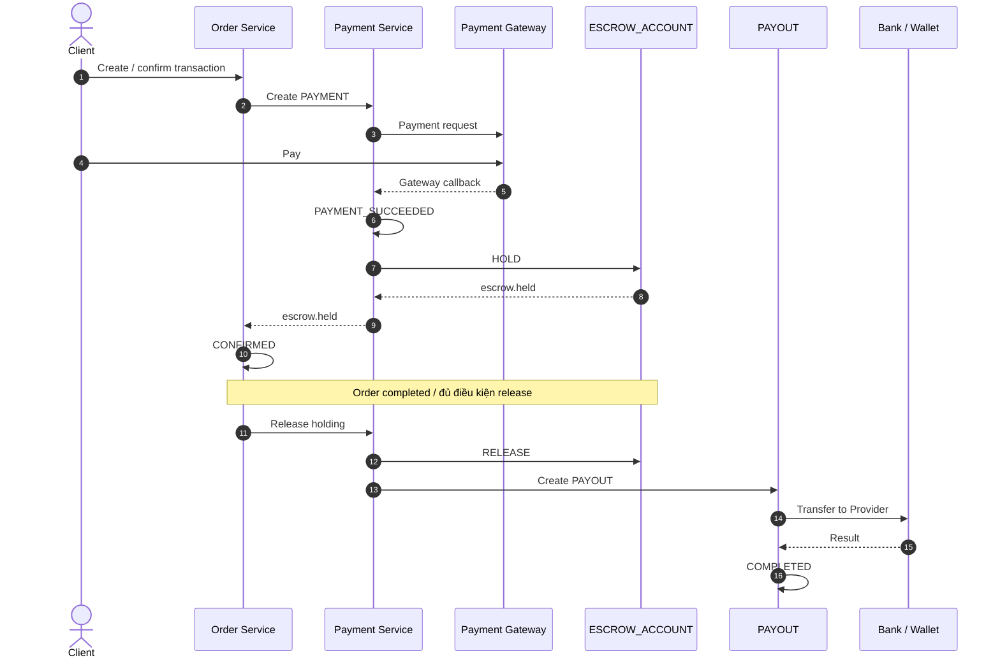

### Diễn giải chi tiết

1. Order yêu cầu Payment Service tạo `PAYMENT`.
2. Payment Service giao dịch với Payment Gateway.
3. Client thực hiện thanh toán.
4. Gateway callback về Payment Service.
5. Payment chuyển `PAYMENT` thành `SUCCEEDED`.
6. Payment Service tạo/ghi nhận `ESCROW_ACCOUNT` và đưa tiền vào `HOLDING`.
7. Event `escrow.held` được phát về Order Service.
8. Order chuyển sang `CONFIRMED`.
9. Sau khi Order `COMPLETED` hoặc đạt điều kiện release, holding được release.
10. Payment Service tạo `PAYOUT`.
11. `PAYOUT` giải ngân tới `PROVIDER_PAYOUT_ACCOUNT`.
12. Tiền được chuyển tới Bank / Wallet.

### Lưu ý / Business Rules

- Payment là business capability riêng vì liên quan đến:
  ```text
  Money
  Gateway
  Audit
  Idempotency
  Refund
  Holding
  Reconciliation
  ```
- Order **không truy cập trực tiếp database Payment**.
- `ESCROW_ACCOUNT` được mô tả ở mức **holding / escrow-like** trong kiến trúc ứng dụng; không mặc định tuyên bố đây là legal escrow.
- `PAYMENT` và `PAYOUT` là hai nghiệp vụ khác nhau:
  ```text
  PAYMENT = Client → WorkGo / Payment Gateway
  PAYOUT  = WorkGo → Freelancer
  ```
- `gateway_payout_id` dùng để đối soát với hệ thống thanh toán bên ngoài.
- Payout phải có cơ chế idempotency và không được tạo trùng khi xử lý event/retry.
- Ví dụ trong tài liệu:
  ```text
  PAYMENT     = 500.000 VND
  ESCROW HOLD = 500.000 VND
  WORKGO FEE  =  25.000 VND
  PAYOUT      = 475.000 VND
  ```
- Platform fee phải được xác định theo policy/order snapshot; không hard-code vào Payout.
- Payment không lưu `card number` hoặc `CVV`; chỉ lưu gateway transaction/reference.
- `PAYMENT.idempotency_key` là `UNIQUE`.
- Consumer phải chịu được duplicate event.

---

## Flow G – Thanh toán Tiền mặt (Cash Payment)

### Tên luồng
**Luồng Cash Payment – hai bên xác nhận giao nhận tiền**

### Các tác nhân tham gia

- **Client**
- **Provider**
- **Payment Service**
- **CASH_PAYMENT_CONFIRMATION**
- **Trust Service / Dispute**

### Diagram – Sequence

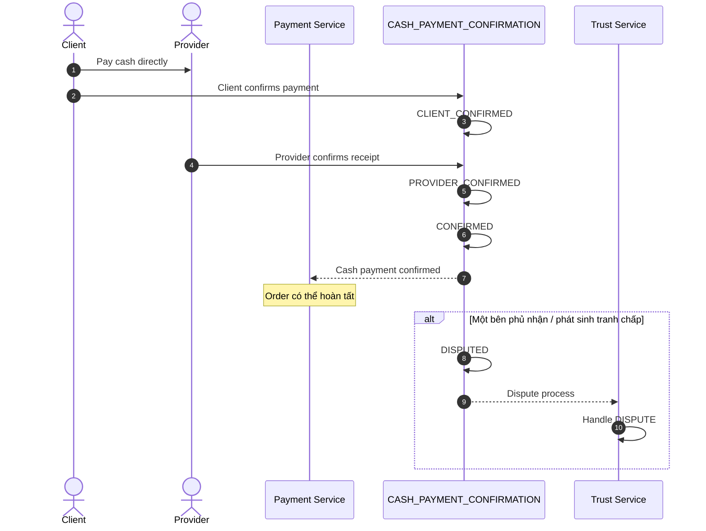

### Diễn giải chi tiết

1. Order sử dụng:
   ```text
   PAYMENT.payment_method = CASH
   ```
2. Client trả tiền trực tiếp cho Provider.
3. Client xác nhận đã thanh toán.
4. `CASH_PAYMENT_CONFIRMATION` chuyển `CLIENT_CONFIRMED`.
5. Provider xác nhận đã nhận tiền.
6. `CASH_PAYMENT_CONFIRMATION` chuyển `PROVIDER_CONFIRMED`.
7. Chỉ khi **cả Client và Provider đều xác nhận**, khoản tiền mới được coi là `CONFIRMED`.
8. Order có thể hoàn tất khi điều kiện nghiệp vụ khác cũng đã đáp ứng.
9. Nếu một bên phủ nhận hoặc phát sinh tranh chấp, khoản tiền **không được tự động coi là đã thanh toán**.
10. Trường hợp tranh chấp chuyển sang quy trình Dispute của Trust Service.

### Lưu ý / Business Rules

- WorkGo **không trực tiếp giữ tiền mặt**.
- Cash không đi qua `ESCROW_ACCOUNT`.
- Quy trình được tài liệu quy định:
  ```text
  Client trả trực tiếp Provider
  → Client xác nhận
  → Provider xác nhận
  → CASH PAYMENT CONFIRMED
  → Order có thể hoàn tất
  ```
- `CASH_PAYMENT_CONFIRMATION.status` có:
  ```text
  PENDING
  CLIENT_CONFIRMED
  PROVIDER_CONFIRMED
  CONFIRMED
  DISPUTED
  CANCELLED
  ```
- Nếu một bên phủ nhận/tranh chấp:
  ```text
  không tự động coi là đã thanh toán
  → Dispute
  ```
- Dispute thuộc Trust Service; Trust không cập nhật trực tiếp database Order.

---

## Flow H – Saga tạo Order & Đền bù (Compensation) khi thanh toán lỗi

### Tên luồng
**Luồng Saga tạo Order, xử lý Payment và Compensation khi có lỗi phân tán**

### Các tác nhân tham gia

- **Client**
- **Order Service**
- **Payment Service**
- **Catalog Service** – đặc biệt với On-site Booking Slot.
- **SAGA_INSTANCE**
- **RabbitMQ**
- **Transactional Outbox**
- **ESCROW_ACCOUNT** – khi Payment đã thành công.

### Diagram – Sequence: Service Listing

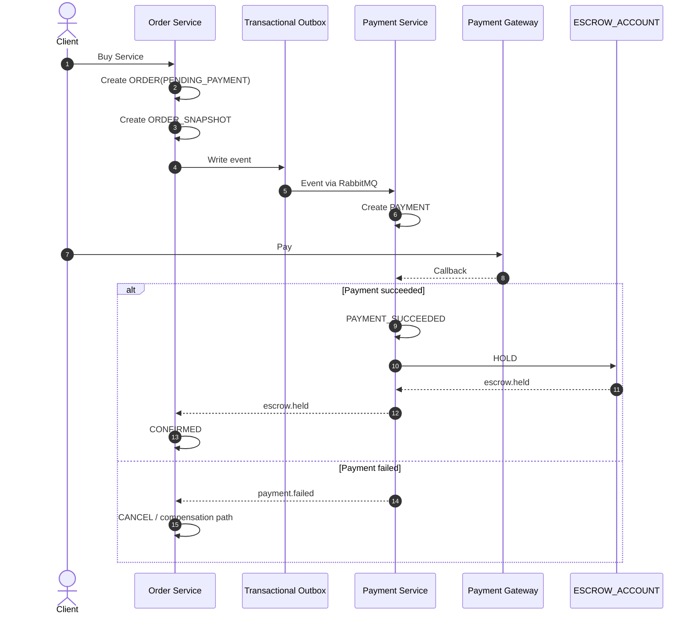

### Diagram – Sequence: On-site Saga

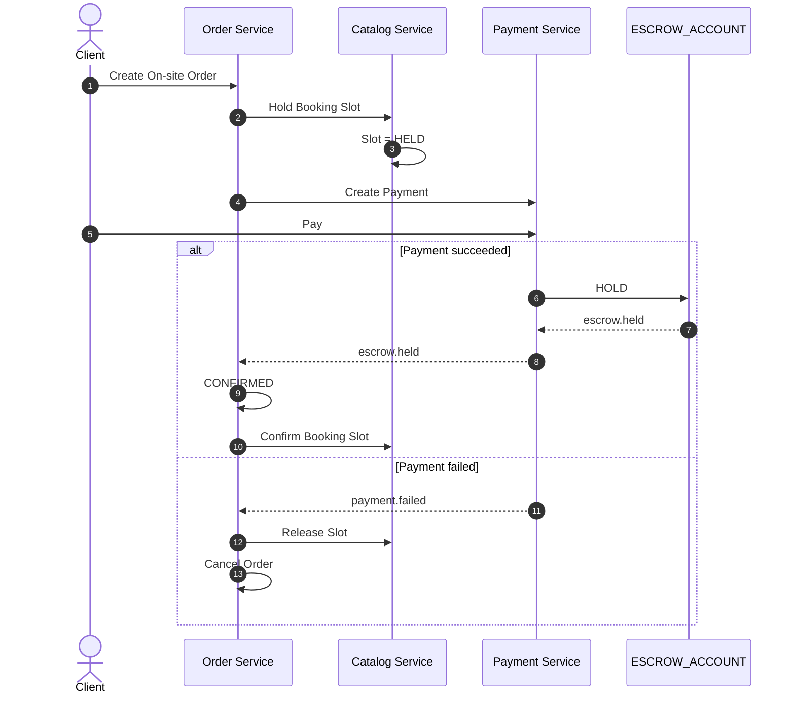

### Diễn giải chi tiết

#### A. Saga tạo Order – Service Listing

1. Client mua Service.
2. Order Service tạo:
   ```text
   ORDER(PENDING_PAYMENT)
   ```
3. Order Service tạo `ORDER_SNAPSHOT`.
4. Business transaction ghi event vào `OUTBOX_EVENT`.
5. Worker đưa event qua RabbitMQ.
6. Payment Service tạo Payment.
7. Client thanh toán.
8. Payment Gateway callback.
9. Nếu Payment thành công:
   - `PAYMENT_SUCCEEDED`
   - `ESCROW HOLDING`
   - phát `escrow.held`
   - Order chuyển `CONFIRMED`.
10. Nếu Payment thất bại, Saga đi vào compensation path theo resource đã được tạo/giữ.

#### B. Saga On-site Order

1. Create Order.
2. Hold Booking Slot.
3. Create Payment.
4. Client pays.
5. Escrow `HOLDING`.
6. Order `CONFIRMED`.
7. Confirm Booking Slot.

#### C. Compensation khi Payment lỗi

Nếu:

```text
Order created
+
Slot held
+
Payment failed
```

thì:

```text
Release Slot
+
Cancel Order
```

Nếu:

```text
Payment succeeded
+
Later step failed
```

thì tùy transaction:

```text
Refund
+
Release resource
+
Cancel Order
```

### Lưu ý / Business Rules

- Các nghiệp vụ liên service cần Saga.
- `SAGA_INSTANCE` lưu:
  ```text
  saga_type
  correlation_id
  current_step
  state
  context
  ```
- Status:
  ```text
  STARTED
  COMPENSATING
  COMPLETED
  FAILED
  ```
- `correlation_id` thường là Order ID nhưng **không có FK xuyên service**.
- Mọi compensation phải **idempotent**.
- Transactional Outbox được dùng để tránh trường hợp:
  ```text
  DB success
  +
  RabbitMQ failure
  →
  data/event inconsistent
  ```
- Business transaction phải thực hiện:
  ```text
  BEGIN
      UPDATE business_data
      INSERT outbox_event
  COMMIT
  ```
- Sau đó worker đọc `OUTBOX_EVENT` và publish qua RabbitMQ.
- Consumer phải chịu được duplicate event.
- Ví dụ `escrow.held` xuất hiện nhiều lần không được tạo `CONFIRMED` nhiều lần.
- Không dùng FK xuyên database; liên service dùng REST API, Event, RabbitMQ, Read Model hoặc Saga tùy nghiệp vụ.

---

# Phần 4. Nhóm luồng Hậu giao dịch (Post-Transaction Flows)

## Flow I – Đánh giá và Tính độ uy tín (Trust & Review Flow)

### Tên luồng
**Luồng Review sau khi Order hoàn thành và cập nhật Reputation**

### Các tác nhân tham gia

- **Client**
- **Provider**
- **Order Service**
- **RabbitMQ / Event**
- **Trust Service**
- **Review**
- **Reputation / Provider Summary**

### Diagram – Sequence

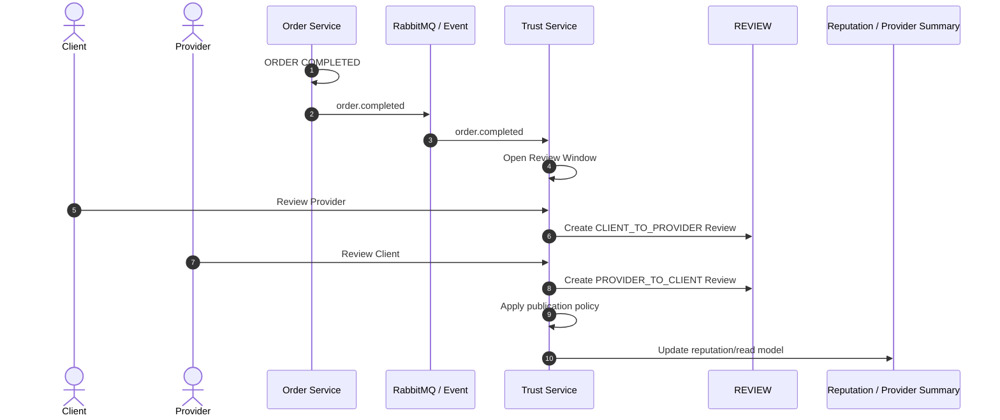

### Diễn giải chi tiết

1. Order Service chuyển Order sang `COMPLETED`.
2. Order Service phát event:
   ```text
   order.completed
   ```
3. Trust Service nhận event.
4. Trust mở Review Window.
5. Client có thể review Provider.
6. Provider có thể review Client.
7. Review được lưu trong `REVIEW` thuộc Trust Service.
8. Mỗi Order tối đa một Review cho mỗi direction:
   ```text
   UNIQUE(order_id, direction)
   ```
9. Review có hai direction:
   ```text
   CLIENT_TO_PROVIDER
   PROVIDER_TO_CLIENT
   ```
10. Trust áp dụng publication policy.
11. Review/reputation được dùng để xây dựng thông tin uy tín và các read model liên quan đến Provider.

### Lưu ý / Business Rules

- `REVIEW` **không thuộc Order Service**.
- Order Service chỉ phát:
  ```text
  order.completed
  ```
  để Trust Service xử lý Review.
- Flow cốt lõi:
  ```text
  ORDER COMPLETED
       ↓
  order.completed
       ↓
  trust-service
       ↓
  Review Window
       ↓
  REVIEW
       ↓
  Reputation
  ```
- Mỗi Order tối đa một Review cho mỗi `direction`.
- Có thể hỗ trợ Double-blind Review:
  ```text
  Client review Provider
  Provider review Client
  ```
- Review chỉ được công khai theo policy khi:
  ```text
  cả hai đã review
  ```
  hoặc:
  ```text
  review window hết hạn
  ```
- `PROVIDER_PROFILE.rating_avg`, `rating_count`, `completed_order_count` là **read model / dữ liệu tổng hợp**, không phải source of truth của Review.
- Trust không cập nhật trực tiếp database Order.
- Nếu Trust cần thay đổi trạng thái Order:
  ```text
  Trust
   ↓
  decision/event
   ↓
  Order Service
   ↓
  Order state
  ```

---

# Phụ lục A. Order State Machine dùng chung

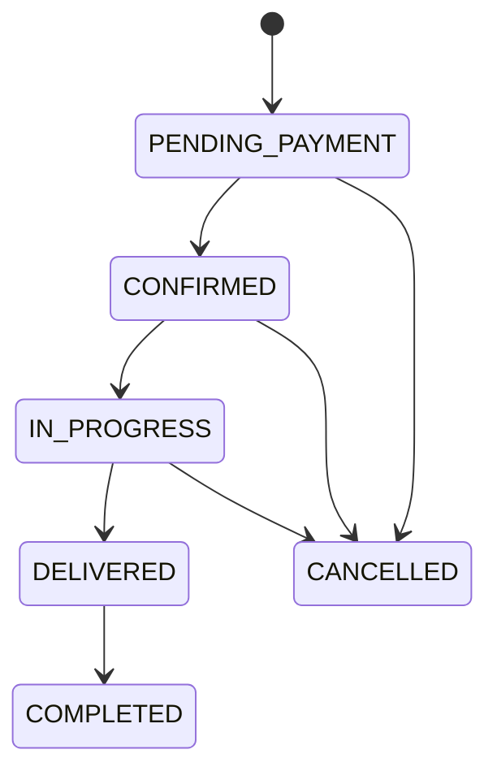

### Quy tắc

- Đây là state machine chung của Order.
- Execution subtype quyết định chi tiết trạng thái thực hiện.
- Không dùng `workflow_code`.
- Khái niệm thống nhất là `execution_type`.

---

# Phụ lục B. Execution Type và nhóm luồng

| `execution_type` | Ý nghĩa | Evidence / đặc điểm | Logistics |
|---|---|---|---|
| `DIGITAL` | Bàn giao online/file | File | Không |
| `ONSITE` | Thực hiện tại địa điểm | Photo/OTP | Có thể |
| `APPOINTMENT` | Dịch vụ theo lịch hẹn | Attendance | Có thể |
| `HOURLY` | Tính theo thời gian | Time record | Tuỳ |
| `PROJECT` | Dự án nhiều bước | Deliverable | Không |
| `DELIVERY` | Pickup → destination | Proof | Có |

> `APPOINTMENT`, `HOURLY` và `PROJECT` được kiến trúc đánh dấu **PLANNED** ở phần entity execution; tài liệu này chỉ trình bày chi tiết các execution flow mà kiến trúc mô tả rõ: `DIGITAL`, `ONSITE` và `DELIVERY`.

---

# Phụ lục C. Các boundary không được trộn trong Flow

```text
Identity Service
├── User
├── Role
├── Provider Profile
├── Provider Verification
└── Address

Catalog Service
├── Category
├── Service
├── Package
├── Add-on
├── Availability
└── Booking Slot

Post Service
├── Post
├── Application
└── Proposal

Communication Service
├── Conversation
├── Message
└── Notification

Order Service
├── Order
├── Order Snapshot
├── Execution
├── Delivery Submission
├── Work Evidence
└── Saga / Outbox

Payment Service
├── Payment
├── Holding / Escrow-like
├── Refund
├── Provider Payout Account
└── Payout

Logistic Service
├── LOGISTICS_DELIVERY
├── Location Update
└── Delivery Proof

Trust Service
├── Review
├── Report
└── Dispute
```

### Các nguyên tắc boundary quan trọng

1. `Execution` là module trong **Order Service**, không phải microservice độc lập.
2. `Review` thuộc **Trust Service**, không tạo `REVIEW` trong Order Service.
3. `Provider Verification` chi tiết thuộc **Identity Service** cùng với Provider Profile.
4. `Payment` là microservice riêng.
5. `Logistics` là microservice riêng cho physical movement.
6. Mỗi Service sở hữu database riêng.
7. Không có Foreign Key xuyên Service.
8. Liên service dùng REST API, Event, RabbitMQ, Read Model hoặc Saga tùy nghiệp vụ.
9. Transactional Outbox dùng cho event reliability.
10. Consumer phải idempotent.

---

# Phụ lục D. Event chính liên quan đến các Flow

```text
application.created
application.withdrawn

proposal.created
proposal.accepted
proposal.rejected

order.created
order.confirmed
order.started
order.delivered
order.completed
order.cancelled

payment.created
payment.succeeded
payment.failed

escrow.held
escrow.released

refund.created
refund.completed

message.created
notification.created

delivery.created
delivery.status_changed
delivery.completed
delivery.proof_added

review.published
report.created
dispute.opened
dispute.resolved
```

---

# Phụ lục E. Quy tắc reliability áp dụng xuyên các Flow

## Transactional Outbox

```text
Business Transaction
      ↓
UPDATE business_data
      +
INSERT outbox_event
      ↓
COMMIT
      ↓
OUTBOX_EVENT
      ↓
RabbitMQ
```

Không dùng mô hình chỉ:

```text
DB COMMIT
   ↓
RabbitMQ publish
```

vì có thể xảy ra:

```text
DB success
RabbitMQ failure
→ data/event inconsistent
```

## Idempotency

Mọi consumer phải chịu được duplicate event.

Ví dụ:

```text
escrow.held
escrow.held
```

không được dẫn tới:

```text
CONFIRMED
CONFIRMED
```

Payment creation phải có:

```text
idempotency_key
```

Compensation cũng phải idempotent.

---

# Kết luận cấu trúc Flow của WorkGo

```text
                    WORKGO
                       │
          ┌────────────┴────────────┐
          │                         │
       FLOW A                     FLOW B
 Service Listing              Post Marketplace
          │                         │
          │                    Apply → Proposal
          │                         │
          │                      Accept
          │                         │
          └───────────┬─────────────┘
                      │
                    ORDER
                      │
             ┌────────┼────────┐
             │        │        │
          DIGITAL   ONSITE   DELIVERY
             │        │        │
             └────────┼────────┘
                      │
                   PAYMENT
                      │
          ┌───────────┴───────────┐
          │                       │
       ONLINE                    CASH
          │                       │
   ESCROW HOLDING          2-side confirmation
          │                       │
   RELEASE / REFUND           CONFIRMED
          │
        PAYOUT
          │
       PROVIDER
                      │
                      ▼
                  COMPLETED
                      │
               order.completed
                      │
                      ▼
                TRUST / REVIEW
                      │
                      ▼
                 REPUTATION
```

**Nguyên tắc cốt lõi của kiến trúc:** hai nguồn tạo Order là `Service Listing` và `Post Marketplace`; `Apply` không tạo Order; `execution_type` thống nhất cách thực hiện; `Execution` nằm trong Order Service; Payment và Logistics là microservice riêng; Review thuộc Trust Service; Saga + Transactional Outbox + Idempotency bảo đảm xử lý liên service.
